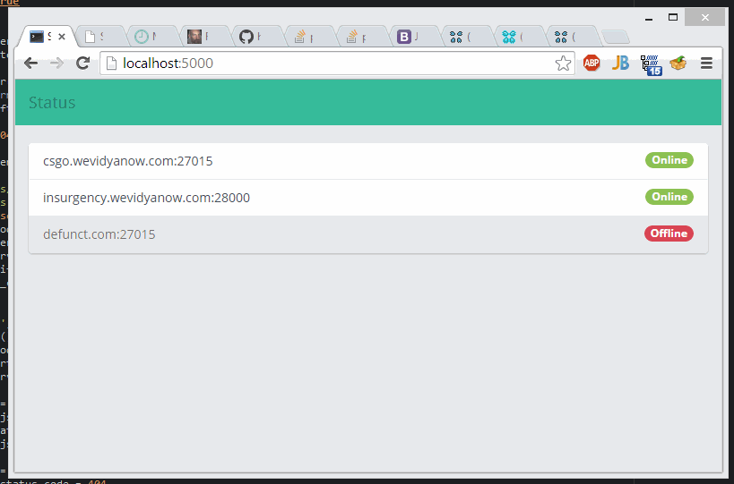

source-server-listing
=====================

Source server offline/online status listing of servers. When finished it will be the basis for an equivalent dealing with Minecraft servers.

**Note to self:** When using composite keys with SQLAlchemy and the `.get()` query to grab the object, use them as a tuple. Example:

```python
> a = Server.query.get(('defunct.com', 27015))
```

requires
--------

Requires [python-valve](https://github.com/Holiverh/python-valve).

example
-------

(so far)


